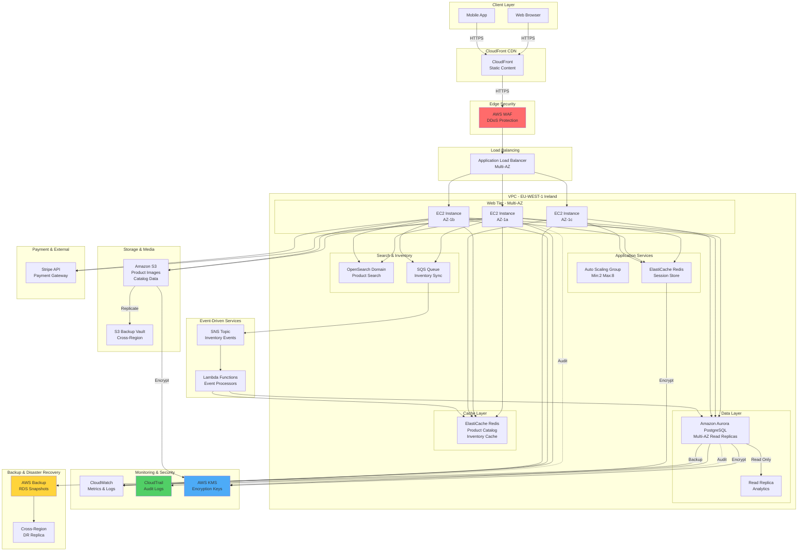

# E-Commerce Platform - Architecture Diagram

## Architecture Components

### Compute Layer
- **ALB (Application Load Balancer)**: Distributes 10K concurrent users across multiple AZs
- **EC2 Auto Scaling Group**: Horizontally scales application servers (min 2, max 8 instances)
- **ElastiCache Redis**: Session management and real-time cache for product data

### Data Layer
- **Aurora PostgreSQL Multi-AZ**: Ensures 99.95% uptime with automatic failover
- **Read Replicas**: Handle analytics queries without impacting production
- **OpenSearch**: Full-text search for 1M product catalog

### Real-Time Inventory Sync
- **SQS**: Decouples inventory updates from web tier
- **SNS**: Publishes inventory events
- **Lambda**: Processes events and updates caches
- **Redis Cache**: Stores inventory state for microsecond lookups

### Storage & CDN
- **S3**: Product images, static content
- **CloudFront**: Global content delivery with EU edge locations
- **Cross-Region S3**: Disaster recovery backup

### Security & Compliance
- **WAF**: Protects against common web exploits
- **KMS**: Encryption for data at rest
- **CloudTrail**: GDPR-compliant audit logging
- **VPC**: Isolated network with security groups

### Disaster Recovery
- **AWS Backup**: Automated RDS snapshots every 4 hours
- **Cross-Region Replica**: Failover capability in seconds
- **S3 Cross-Region Replication**: Data durability
