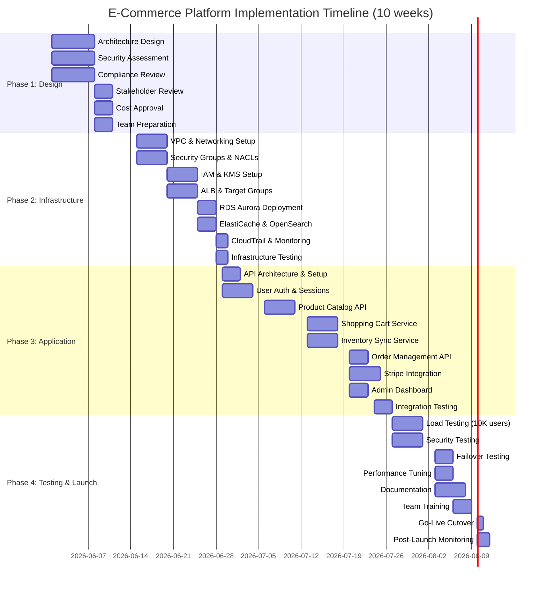

# Project Implementation Plan
## E-Commerce Platform on AWS - 10 Week Timeline

---

## Executive Overview

**Project Duration:** 10 weeks (June 1 - August 10, 2026)  
**Team Size:** 4 full-time engineers  
**Phase Breakdown:** 4 sequential phases with overlapping work

### Timeline at a Glance

```
Week 1-2:  ████████░░░░░░░░░░░░░░░░░░░░░░  Design & Planning (P1)
Week 3-4:  ░░████████████░░░░░░░░░░░░░░░░░  Infrastructure (P2)
Week 5-8:  ░░░░░░░░████████████████████░░░  App Development (P3)
Week 9-10: ░░░░░░░░░░░░░░░░░░░░░░░░░░████  Testing & Cutover (P4)
```

---

## Gantt Chart (Mermaid Format)



---

## Detailed Work Breakdown Structure (WBS)

### Phase 1: Design & Planning (Weeks 1-2)
**Goal:** Gain stakeholder approval and team readiness for infrastructure deployment

#### Week 1: Design & Assessment

**Monday-Wednesday: Core Architecture Design**
- [ ] Final architecture decisions (multi-AZ setup, service selection)
- [ ] Create detailed architecture diagrams (Mermaid)
- [ ] Document all AWS services and rationale
- [ ] Network design finalization (VPC CIDR, subnets, AZs)
- [ ] Performance SLA validation (99.95% uptime mapping)

**Thursday-Friday: Security & Compliance**
- [ ] Security risk assessment (threat model)
- [ ] GDPR compliance gap analysis
- [ ] Data residency validation (eu-west-1)
- [ ] Encryption strategy review
- [ ] DPA preparation with AWS

**Deliverable:** Architecture Design Document (D1 draft)

#### Week 2: Approval & Preparation

**Monday-Tuesday: Stakeholder Reviews**
- [ ] Architecture review meeting with stakeholders
- [ ] Security team Q&A session
- [ ] Compliance team sign-off
- [ ] Cost model approval
- [ ] Timeline and resource confirmation

**Wednesday-Friday: Team Preparation**
- [ ] Team skill assessment (Terraform, AWS, Python/Node.js)
- [ ] Training plan (AWS fundamentals if needed)
- [ ] Tool setup (Git, Terraform, IDE, AWS CLI)
- [ ] Team onboarding for phase 2 (DevOps lead kickoff)
- [ ] Establish communication channels (Slack, weekly standups)

**Deliverable:** Signed-off Architecture Design Document (D1)

**Team Allocation:**
- Solutions Architect: 80% (design, documentation, stakeholder mgmt)
- Security Engineer: 50% (risk assessment, compliance review)
- DevOps Lead: 20% (preparation for phase 2)

---

### Phase 2: Infrastructure Deployment (Weeks 3-4)
**Goal:** Fully functional AWS infrastructure in staging environment, ready for application deployment

#### Week 3: Core Infrastructure

**Monday-Tuesday: VPC & Network Foundation**
```
Tasks:
  - Create VPC (10.0.0.0/16)
  - Create 3 public subnets (10.0.1.0/24, 10.0.2.0/24, 10.0.3.0/24)
  - Create 3 private subnets (10.0.11.0/24, 10.0.12.0/24, 10.0.13.0/24)
  - Deploy NAT Gateways in each public subnet
  - Configure route tables (IGW, NAT)
  - Enable VPC Flow Logs to CloudWatch
  - Create bastion host for SSH access (optional)

Terraform:
  - vpc.tf (VPC, subnets, route tables)
  - nat.tf (NAT gateways, EIPs)
  - vpc_flow_logs.tf
```

**Wednesday-Thursday: Security Foundation**
```
Tasks:
  - Create Security Groups for:
    - ALB (inbound: 80, 443 from 0.0.0.0/0)
    - EC2 app tier (inbound: 8080 from ALB; 22 from bastion)
    - RDS (inbound: 5432 from EC2, Lambda)
    - Redis (inbound: 6379 from EC2)
    - OpenSearch (inbound: 9200 from EC2)
  - Create NACLs for additional layer
  - Configure security group egress rules (principle of least privilege)
  - Create IAM roles for each service

Terraform:
  - security_groups.tf
  - nacls.tf
  - iam_roles.tf (AppRole, AdminRole, LambdaRole)
```

**Friday: KMS & Secrets**
```
Tasks:
  - Create KMS master key for encryption at rest
  - Set key policies (allow EC2, RDS, Lambda, S3 services)
  - Create AWS Secrets Manager secrets for:
    - Database password
    - Stripe API key
    - Admin API token
  - Enable CloudTrail (audit logging)

Terraform:
  - kms.tf
  - secrets_manager.tf
  - cloudtrail.tf
```

**Deliverable:** VPC + security infrastructure in staging

#### Week 4: Data & Compute Infrastructure

**Monday: Compute Layer**
```
Tasks:
  - Create ALB (application load balancer)
    - Enable sticky sessions (shopping cart)
    - Add health check rules
  - Create Target Group for EC2 instances
  - Create Auto Scaling Group
    - Min instances: 2
    - Max instances: 8
    - Desired capacity: 2 (scale based on CPU >70%)
  - Create AMI with baseline software (Python/Node, monitoring agent)
  - Test ASG scaling behavior

Terraform:
  - alb.tf (ALB, target groups, health checks)
  - asg.tf (launch template, auto scaling group)
  - ec2.tf (instance configuration)
```

**Tuesday-Wednesday: Data Layer**
```
Tasks:
  - Create RDS Aurora PostgreSQL
    - Multi-AZ enabled (automatic failover)
    - Instance type: db.t3.large
    - Storage: 500GB (gp3)
    - Backup retention: 7 days
    - Enable encryption with KMS key
  - Create read replica in second AZ
  - Test failover (manual switchover)
  - Create database schema and indexes
  - Set up connection pooling (PgBouncer)

Tasks:
  - Create ElastiCache Redis cluster
    - Multi-AZ enabled
    - Instance type: cache.r6g.xlarge (6GB)
    - Enable encryption (TLS)
    - Set up replication group for failover
    - Configure eviction policy (allkeys-lru)

Terraform:
  - rds_aurora.tf (DB cluster, instances, backups)
  - elasticache.tf (Redis cluster, parameter group)
  - database_schema.tf (SQL init scripts)
```

**Thursday-Friday: Search & Monitoring**
```
Tasks:
  - Create OpenSearch cluster
    - 3-node cluster (1 master, 2 data)
    - Multi-AZ enabled
    - Instance type: r6g.large per node
    - Storage: 100GB
    - Enable encryption, TLS
  - Create indices for products, categories, reviews

Tasks:
  - Configure CloudWatch
    - Create log groups for app, RDS, Lambda, ALB
    - Set up custom metrics (inventory sync latency, cache hit ratio)
    - Create dashboards for real-time monitoring
  - Configure CloudWatch Alarms
    - High CPU (EC2, RDS)
    - High memory (cache)
    - ALB target unhealthy
    - RDS replication lag
  - Create SNS topics for alerts (PagerDuty integration optional)

Terraform:
  - opensearch.tf (cluster, domain settings)
  - cloudwatch.tf (log groups, alarms, dashboards)
  - sns.tf (alert topics)
```

**Infrastructure Testing**
```
Tests:
  - [ ] VPC connectivity (can EC2 reach RDS, Redis, OpenSearch?)
  - [ ] Security group rules (verify ingress/egress)
  - [ ] RDS failover (manual switchover, measure downtime)
  - [ ] Redis failover (automatic, verify persistence)
  - [ ] ALB health checks (confirm target status)
  - [ ] ASG scaling (simulate CPU increase, verify scaling)
  - [ ] S3 bucket encryption (verify KMS key in use)
  - [ ] CloudTrail logging (confirm events captured)
```

**Deliverable:** Terraform modules (D2), staging infrastructure ready

**Team Allocation:**
- DevOps Lead: 100% (architecture, task coordination)
- DevOps Engineer: 100% (implementation, testing)
- Solutions Architect: 20% (guidance, decisions)

---

### Phase 3: Application Development (Weeks 5-8)
**Goal:** Production-ready API and services, tested and integrated with AWS infrastructure

#### Week 5-6: Core API Development

**Week 5: Authentication & Foundation**
```
Monday-Tuesday: Project Setup
  - [ ] Initialize git repository
  - [ ] Set up CI/CD pipeline (GitHub Actions / GitLab CI)
  - [ ] Code quality tools (linting, formatting, testing)
  - [ ] Environment configuration (dev, staging, prod)
  - [ ] Dependency management (lock files)
  - [ ] Logging and structured JSON logs

Wednesday-Friday: User Authentication Service
  - [ ] User model (PostgreSQL schema)
  - [ ] Password hashing (bcrypt, min 12 rounds)
  - [ ] JWT token generation and validation
  - [ ] Session management (Redis TTL: 24 hours)
  - [ ] Login/logout endpoints
  - [ ] Password reset flow
  - [ ] MFA support (email OTP)
  - [ ] Unit tests for auth module (≥90% coverage)

Endpoints:
  POST /auth/register
  POST /auth/login
  POST /auth/logout
  POST /auth/refresh-token
  POST /auth/mfa/verify
  POST /auth/password-reset
```

**Week 6: Product Catalog & Search**
```
Monday-Tuesday: Product API
  - [ ] Product model (PostgreSQL schema)
  - [ ] Product API endpoints (paginated, filtered)
  - [ ] Category endpoints
  - [ ] Full-text search integration (OpenSearch)
  - [ ] Caching strategy (Redis, TTL: 1 hour)
  - [ ] Query optimization (N+1 prevention)
  - [ ] Unit and integration tests

Endpoints:
  GET /products (paginated, filterable, searchable)
  GET /products/{id}
  GET /categories
  GET /products/search (full-text, via OpenSearch)
  POST /admin/products (create/update - admin only)
```

**Wednesday-Friday: Shopping Cart Service**
```
Tasks:
  - [ ] Cart model (Redis session-based)
  - [ ] Add to cart / remove from cart endpoints
  - [ ] Cart persistence across sessions
  - [ ] Cart expiration (7 days inactivity)
  - [ ] Quantity validation against inventory
  - [ ] Unit tests

Endpoints:
  GET /cart
  POST /cart/items
  PUT /cart/items/{id}
  DELETE /cart/items/{id}
  POST /cart/checkout
```

**Deliverable:** Core APIs tested and documented (OpenAPI spec)

#### Week 7: Payments & Inventory Sync

**Week 7: Order Management & Payments**
```
Monday-Tuesday: Order Service
  - [ ] Order model (PostgreSQL schema)
  - [ ] Order creation from cart
  - [ ] Order status tracking (pending, confirmed, shipped)
  - [ ] Order history endpoints
  - [ ] Unit tests

Endpoints:
  POST /orders (create from cart)
  GET /orders
  GET /orders/{id}
  PUT /orders/{id}/status (admin)
```

**Wednesday-Friday: Stripe Integration**
```
Tasks:
  - [ ] Stripe account setup (test + live keys)
  - [ ] Payment intent creation API
  - [ ] Payment capture and confirmation
  - [ ] Webhook handler for payment events
    - payment_intent.succeeded
    - payment_intent.payment_failed
    - charge.refunded
  - [ ] PCI compliance validation (no card data stored)
  - [ ] Error handling for payment failures
  - [ ] Unit tests for payment flows

Endpoints:
  POST /payments/create-intent
  POST /payments/confirm
  POST /webhooks/stripe (webhook handler)
  POST /orders/{id}/refund (admin)
```

**Real-Time Inventory Sync Architecture:**
```
Flow:
  1. Web tier: User updates cart/places order
  2. App publishes inventory delta to SQS
     {product_id, quantity_delta, timestamp}
  3. Lambda triggered by SQS (batch every 1 sec or 100 msgs)
  4. Lambda updates:
     - RDS Aurora (inventory count)
     - Redis cache (inventory state)
  5. Lambda publishes SNS event (for webhooks)
  6. Webhooks notify external systems

SQS Queue: inventory-sync-queue
Lambda: process-inventory-sync
SNS Topic: inventory-updates
```

#### Week 8: Admin Dashboard & Integration

**Week 8: Admin Dashboard & Final Integration**
```
Monday-Tuesday: Admin Endpoints
  - [ ] Admin authentication (role-based access)
  - [ ] Dashboard analytics (revenue, orders, users)
  - [ ] Inventory management (add/update/delete products)
  - [ ] Order management (view, cancel, refund)
  - [ ] User management (list, ban, reset password)
  - [ ] System health endpoints

Endpoints:
  GET /admin/dashboard/stats
  GET /admin/products
  POST /admin/products
  PUT /admin/products/{id}
  DELETE /admin/products/{id}
  GET /admin/orders
  GET /admin/users
  GET /health (system status)
```

**Wednesday-Thursday: Integration & Testing**
```
Tasks:
  - [ ] End-to-end integration tests
    - User registration -> login -> browse -> add to cart -> checkout
  - [ ] Database connection pooling (load test)
  - [ ] Cache hit ratio validation
  - [ ] OpenSearch indexing performance
  - [ ] Error handling and retry logic

Tests:
  - API contract tests (request/response schema)
  - Database transaction tests (ACID compliance)
  - Cache invalidation tests
  - Concurrent write tests
```

**Friday: Documentation & Handoff**
```
Tasks:
  - [ ] OpenAPI/Swagger documentation
  - [ ] Architecture diagrams (component view)
  - [ ] Deployment runbook
  - [ ] Local development setup guide
  - [ ] API usage examples
  - [ ] Known issues and workarounds
```

**Deliverable:** Production API and services (D3)

**Team Allocation:**
- Full Stack Engineers (3): 100% each on different components
- QA Engineer: 50% (testing, validation)

---

### Phase 4: Testing, Hardening & Go-Live (Weeks 9-10)
**Goal:** Production-ready system with verified uptime, security, and compliance

#### Week 9: Comprehensive Testing

**Monday-Tuesday: Load Testing**
```
Scenario 1: Baseline Load (10K concurrent users)
  - Duration: 30 minutes
  - Ramp-up: 1 minute (100 users/sec)
  - Target: <200ms p99 latency, 0% error rate
  - Metrics: Throughput, CPU, memory, cache hit ratio

Scenario 2: Peak Load (15K concurrent users)
  - Duration: 15 minutes
  - Validate auto-scaling behavior
  - Measure: Response time degradation, cache effectiveness

Scenario 3: Stress Test (20K concurrent users)
  - Duration: 5 minutes
  - Find breaking point
  - Document max capacity

Tools: Apache JMeter, K6, Locust
Results: Load test report (D5) with optimization recommendations
```

**Wednesday-Thursday: Security & Compliance Testing**
```
Security Testing:
  - [ ] OWASP Top 10 validation
    - SQL injection (parameterized queries)
    - Cross-site scripting (input validation)
    - Authentication bypass (JWT validation)
    - Sensitive data exposure (TLS, encryption)
  - [ ] Penetration testing (3rd party recommended)
  - [ ] API security (rate limiting, JWT expiration)
  - [ ] IAM policy review (least-privilege)
  - [ ] S3 bucket public access validation
  - [ ] CloudTrail audit logging verification

GDPR Compliance Checks:
  - [ ] Data residency (all data in eu-west-1?)
  - [ ] Encryption in transit (TLS 1.2+)
  - [ ] Encryption at rest (KMS verified)
  - [ ] Audit logging (CloudTrail, VPC Flow Logs)
  - [ ] Right to erasure (deletion procedures)
  - [ ] Data minimization (no unnecessary PII)

SOC 2 Type II Controls:
  - [ ] CC5.1: Logical access (IAM, security groups)
  - [ ] CC6.2: Encryption (KMS, TLS)
  - [ ] CC7.1: Monitoring (CloudWatch, CloudTrail)
  - [ ] A1.1: Change management (CloudTrail audit)
```

**Friday: Failover Testing & RTO/RPO Validation**
```
RDS Failover Test:
  - [ ] Initiate manual failover (Aurora primary → replica)
  - Measure: Downtime (target: <3 minutes)
  - Verify: Automatic DNS update
  - Verify: Read replica promotion
  - Result: RTO ≤3 min, RPO = 0

Cache Failover Test:
  - [ ] Simulate Redis node failure
  - Verify: Automatic failover to replica
  - Measure: Session loss (should be zero)
  - Verify: App reconnection

Auto Scaling Test:
  - [ ] Trigger scaling event (CPU >70%)
  - Measure: Time to launch new instance (<5 min)
  - Verify: Target group updated
  - Verify: Health checks passing

Backup Validation:
  - [ ] Restore RDS from snapshot
  - [ ] Restore S3 objects from versioning
  - [ ] Verify data integrity
```

#### Week 10: Documentation, Training & Go-Live

**Monday-Tuesday: Final Documentation & Training**
```
Documentation Deliverables:
  - [ ] Operational runbooks (D6)
    - Deploy application
    - Rollback procedure
    - Scale up/down
    - Database backup/restore
    - SSL certificate renewal
    - Disaster recovery
  - [ ] Incident response playbook
    - High CPU alert → investigation steps
    - RDS replication lag → mitigation
    - Payment API failure → fallback
    - Security incident → containment
  - [ ] On-call rotation and escalation procedures
  - [ ] Monitoring dashboard tutorial

Team Training:
  - [ ] 4-hour AWS fundamentals review
  - [ ] Incident response simulation (war game)
  - [ ] Runbook walkthrough
  - [ ] On-call procedures and escalation
  - [ ] Post-incident review process
```

**Wednesday-Thursday: Pre-Go-Live Validation**
```
Production Readiness Checklist:
  - [ ] Load test results confirm 99.95% uptime
  - [ ] Security testing: No Critical/High vulnerabilities
  - [ ] GDPR compliance verified
  - [ ] SOC 2 controls in place
  - [ ] RTO/RPO validated
  - [ ] Monitoring and alerting operational
  - [ ] Incident response playbook tested
  - [ ] Team trained and signed off
  - [ ] DNS and SSL certificates ready
  - [ ] Rollback procedure validated

Go-Live Checklist (D8):
  - [ ] Production environment prepared
  - [ ] Database schema applied
  - [ ] S3 buckets created and configured
  - [ ] KMS keys rotated and ready
  - [ ] CloudTrail and audit logging active
  - [ ] Monitoring dashboards displaying real data
  - [ ] Incident response team on standby
  - [ ] Communication plan (status page, team notifications)
  - [ ] Customer communication prepared (if applicable)
  - [ ] Rollback plan documented and tested
```

**Friday: Production Cutover**
```
Cutover Plan (DNS Migration):
  - [ ] Time: Low-traffic period (e.g., 2 AM UTC)
  - [ ] Duration: <5 minutes total cutover
  
  Step 1: Pre-Cutover (1 hour before)
    - Health checks on prod infra
    - Incident team assembled
    - Communication channels open
    - Monitoring dashboards active
  
  Step 2: Cutover (5 minutes)
    - Update Route 53 DNS to ALB IP
    - Propagation: ~30-60 seconds globally
    - Monitor error rates and latency
  
  Step 3: Post-Cutover (2 hours)
    - Monitor all critical metrics
    - Check user sessions
    - Verify payment processing
    - Confirm database replication
    - Alert if issues detected
  
  Step 4: Rollback (if needed)
    - Revert Route 53 to previous target
    - Rollback application (blue-green deployment)
    - Customer communication
```

**Post-Go-Live (Week 10 + ongoing)**
```
Hours 0-2: Critical monitoring
  - Error rate
  - Response latency (p50, p95, p99)
  - Cache hit ratio
  - Database connections
  - Auto-scaling behavior

Hours 2-6: Extended monitoring
  - Payment success rate
  - Inventory sync latency
  - User session management
  - S3 access patterns

Day 1-7: Stabilization
  - Monitor for any anomalies
  - Database performance tuning
  - Cache effectiveness validation
  - Cost analysis
  - Early bug fixes (hot fixes if critical)

Week 1+: Optimization & Analysis
  - Quarterly review of costs
  - Reserved instance optimization
  - Performance baseline establishment
  - Ongoing security monitoring
```

---

## Resource Allocation Summary

| Phase | Week(s) | Architect | DevOps Lead | DevOps Eng | App Eng (3x) | QA Eng | Total FTE |
|-------|---------|-----------|-------------|-----------|--------------|--------|-----------|
| P1    | 1-2     | 0.8       | 0.2         | 0          | 0            | 0      | 1.0       |
| P2    | 3-4     | 0.2       | 1.0         | 1.0        | 0            | 0      | 2.2       |
| P3    | 5-8     | 0.1       | 0.1         | 0          | 3.0          | 0.5    | 3.7       |
| P4    | 9-10    | 0.1       | 0.2         | 0.5        | 1.5          | 1.0    | 3.3       |
| **Total (10 weeks)** | | **2.2** | **2.5** | **1.5** | **4.5** | **1.5** | **12.2** |

**Team Capacity:** 4 FTE engineers × 10 weeks = 40 FTE-weeks  
**Planned Work:** ~35-38 FTE-weeks (85-95% utilization with buffer)

---

## Weekly Standup Agenda (30 min)

**Format:** Sync every Monday 10:00 UTC

```
Attendees: All 4 engineers + architect lead
Duration: 30 minutes

Agenda:
  1. What was accomplished last week? (5 min)
  2. What's planned for this week? (5 min)
  3. Blockers or risks? (10 min)
  4. Metrics update (5 min)
     - Code commits
     - Test coverage
     - Infrastructure uptime (P2+)
     - Load test progress
  5. AOB / Next steps (5 min)

Success Metrics (tracked weekly):
  - Phase progress (% complete)
  - Code coverage (target: ≥80%)
  - Infrastructure readiness (P2+)
  - Budget spend vs. plan
  - Risk register updates
```

---

## Key Decision Points & Gate Reviews

### Gate 1: End of Week 2 (P1 Complete)
**Requirement:** Architecture approved by stakeholders
```
Approval criteria:
  [ ] Design document signed off
  [ ] Security risk assessment completed
  [ ] Cost model approved (±15%)
  [ ] Team readiness confirmed
  
Decision: GO / NO-GO to Phase 2
```

### Gate 2: End of Week 4 (P2 Complete)
**Requirement:** Infrastructure ready for application deployment
```
Approval criteria:
  [ ] All infrastructure deployed to staging
  [ ] Security group and IAM rules validated
  [ ] RDS and cache failover tested
  [ ] Terraform modules peer-reviewed
  [ ] Cost tracking on budget
  
Decision: GO / NO-GO to Phase 3
```

### Gate 3: End of Week 8 (P3 Complete)
**Requirement:** Production API ready for load testing
```
Approval criteria:
  [ ] All core APIs implemented
  [ ] Unit test coverage ≥80%
  [ ] Integration tests passing
  [ ] Stripe integration validated (sandbox)
  [ ] OpenAPI documentation complete
  
Decision: GO / NO-GO to Phase 4
```

### Gate 4: End of Week 9 (P4 Partial - Testing)
**Requirement:** Production readiness confirmed
```
Approval criteria:
  [ ] Load test confirms 99.95% uptime capability
  [ ] Security testing: no Critical/High vulnerabilities
  [ ] GDPR compliance verified
  [ ] RTO/RPO validated
  [ ] Monitoring and alerting operational
  
Decision: GO / NO-GO to Production Cutover
```

### Gate 5: Week 10 (Go-Live)
**Requirement:** Cutover approved and executed
```
Pre-cutover:
  [ ] All team members trained
  [ ] Runbooks reviewed and tested
  [ ] Incident response team identified
  [ ] Rollback plan validated
  
Cutover approval: Project Sponsor / CTO

Post-cutover (first 7 days):
  [ ] Monitor metrics continuously
  [ ] Execute stabilization tasks
  [ ] Resolve any critical issues
  [ ] Confirm cost within budget
```

---

## Risk Register & Tracking

### Risk Tracking Table

| Risk ID | Risk | Prob | Impact | Mitigation | Status | Owner |
|---------|------|------|--------|-----------|--------|-------|
| R1 | Timeline slip | Medium | High | Weekly tracking, parallel work, buffer tasks | Active | DevOps Lead |
| R2 | Infrastructure quality | Medium | Medium | Code review, testing in staging, IaC validation | Active | Solutions Architect |
| R3 | 10K load performance | Low | Critical | Load test in week 9, 15K stress test | Active | QA Engineer |
| R4 | GDPR compliance gaps | Low | Critical | Compliance review, CloudTrail validation | Active | Solutions Architect |
| R5 | Team turnover | Low | Medium | Documentation, knowledge sharing, cross-training | Mitigated | DevOps Lead |
| R6 | Stripe integration issues | Low | Medium | Early sandbox testing, webhook validation | Mitigated | App Eng Lead |
| R7 | Database scaling issues | Low | High | Connection pooling, read replicas, load test | Active | DevOps Lead |
| R8 | Cache invalidation bugs | Medium | Medium | Unit tests, integration tests, cache logic review | Active | App Eng Lead |

---

## Success Metrics & KPIs

### Delivery Metrics
- **Phase Completion:** On-time delivery of each phase (target: 100%)
- **Budget Adherence:** Infrastructure cost ≤ $3,506/month (current) → target $2,500/month (optimized)
- **Code Quality:** Unit test coverage ≥80%, <10 bugs per 1000 LOC

### Operational Metrics (Post-Launch)
- **Availability:** 99.95% uptime (≤22 min downtime/month)
- **Latency:** P99 latency <200ms at 10K concurrent users
- **Inventory Sync:** <500ms end-to-end latency
- **Cache Hit Ratio:** >85% for product queries
- **Payment Success Rate:** >95% (Stripe)

### Compliance Metrics
- **GDPR:** 100% data residency in eu-west-1
- **SOC 2:** All 10+ controls operational and documented
- **Audit Logging:** 100% of API calls captured in CloudTrail
- **Incident Response:** RTO ≤3 minutes, RPO = 0

---

## Communication & Escalation

**Escalation Path:**
```
L1: Team Lead (daily standup issues)
  → Weekly review with DevOps Lead

L2: Solutions Architect (architectural issues)
  → Weekly review with Project Sponsor

L3: Project Sponsor / CTO (timeline, budget, risk)
  → Gate review meetings (end of each phase)

L4: Executive Sponsor (project continuity, go/no-go decisions)
  → Go-live decision
```

**Reporting Cadence:**
- **Daily:** Standup (30 min)
- **Weekly:** Progress review + metrics (1 hour)
- **Bi-Weekly:** Sponsor update (30 min) with dashboard
- **Gate Reviews:** End of each phase (2 hours)

---

## Appendix: Tools & Technology Stack

### Development & Deployment
- **IaC:** Terraform 1.5+
- **VCS:** Git (GitHub / GitLab)
- **CI/CD:** GitHub Actions / GitLab CI
- **Monitoring:** CloudWatch, DataDog (optional)
- **Incident Response:** PagerDuty (optional)

### Application
- **Runtime:** Node.js 18 LTS or Python 3.11
- **Framework:** Express.js or FastAPI
- **ORM:** Sequelize or SQLAlchemy
- **API:** REST with JSON

### Testing & Load Testing
- **Unit Testing:** Jest or pytest
- **Integration Testing:** Postman or Rest-Assured
- **Load Testing:** Apache JMeter or K6
- **Security Testing:** OWASP ZAP or Burp Community

### AWS Services (Summary)
- **Compute:** EC2, Auto Scaling, Lambda
- **Database:** RDS Aurora (PostgreSQL), ElastiCache (Redis)
- **Search:** OpenSearch
- **Networking:** ALB, VPC, CloudFront, Route 53
- **Storage:** S3, AWS Backup
- **Security:** WAF, KMS, Secrets Manager, IAM
- **Monitoring:** CloudWatch, CloudTrail, VPC Flow Logs

---

## Final Notes

This implementation plan is intentionally detailed to provide clear guidance while maintaining flexibility for unforeseen changes. The team should:

1. **Update the plan weekly** based on actual progress
2. **Escalate blockers immediately** rather than waiting for standup
3. **Document all decisions** in an ADR (Architecture Decision Record) for future reference
4. **Celebrate milestones** at each gate review (morale boost!)
5. **Learn from any issues** with a blameless post-incident review

**Good luck! This is an ambitious but achievable timeline with a strong team.**
